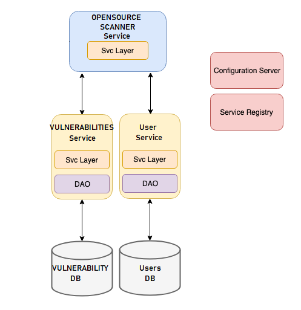
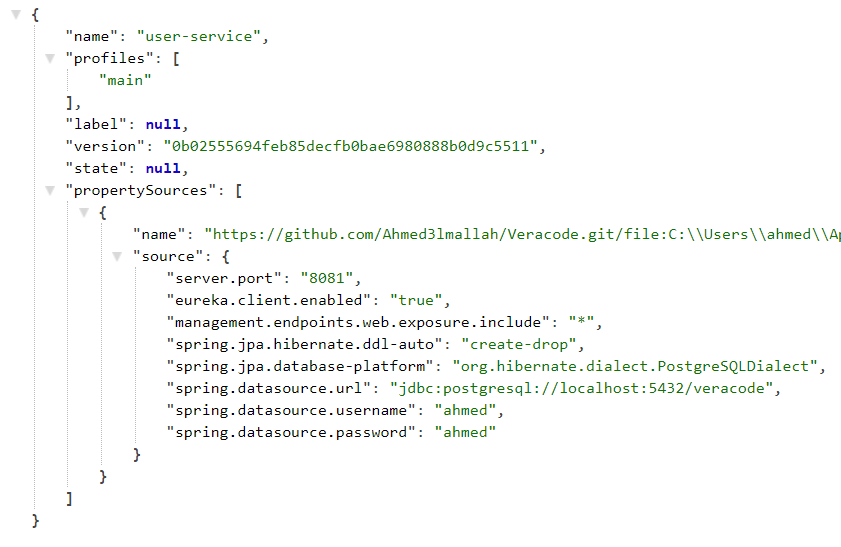
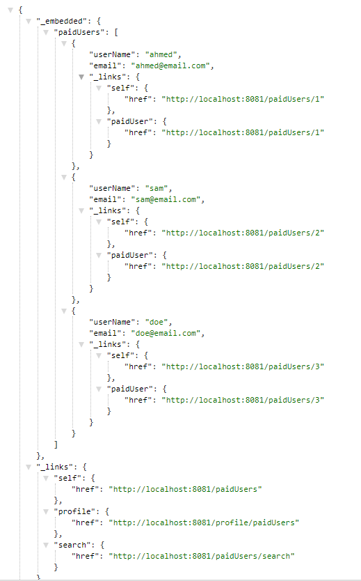

# Veracore

Veracore (not to be confused with Veracode) is a demo tool that can be used to scan public Github repositories for opensource vulnerabilities.

### Logic Flow

* Username is first validated (checked that it exists in the users DB, as opposed to actually using OAuth2), and the project language is checked to ensure it's among the list of supported languages
* The tool uses the [Get repository content API](https://docs.github.com/en/rest/reference/repos#get-repository-content) to locate dependencies files for a given project. For a maven project, the tool will use the API to locate and download the contents of all `pom.xml` files
* `Jackson` is then used to convert the content of the `.xml` file to a list of dependencies
* Each dependency is then checked against the Vulnerabilites DB using the Vulnerabilities Service
* Any finding is then returned to the user

## Architecture

Veracore design is based on modern cloud-native architecture, and it includes the following microservices:

1. **CONFIG-SERVER:** A Configuration Server to host all configuration files
	
	
1. **REGISTRY-SERVICE:** Eureaka Service Registry for server-side load balancing

	
1. Two backend micoservices that serve as the Data layer and used for fetching data from a PostgreSQL DB
	1. **USER-SERVICE:** Fetches and validates user data - Initialized with the following users:
	
		
	1. **VULNERABILITIES-SERVICE:** Fetches vulnerabilities from DB - Initialized with the following vulnerability:
	
		
1. **OPENSOURCE-SCANNER-SERVICE:** An edge micoservice, that collects data from differnt backend services, scan and fetch dependencies for a provided Github repo, and present the results to the user.

	* Request Example: POST http://localhost:8191/scan
	
			{
				"userName":"ahmed",
				"gitRepositoryOwner":"Ahmed3lmallah",
				"gitRepositoryName":"test",
				"gitRepositoryBranch":"master",
				"projectLanguage":"mvn"
			}
			
	* Result Example:

			{
				"validUser": true,
				"supportedLanguage": true,
				"findings": [
					{
						"name": "com.fasterxml.jackson.core:jackson-databind",
						"version": "2.9.9",
						"location": "https://github.com/Ahmed3lmallah/test2/blob/master/queue-service/pom.xml",
						"language": "mvn",
						"severity": "Severe",
						"recommendation": "Upgrade com.fasterxml.jackson.core:jackson-databind to version 2.9.10.7 or later"
					}
				]
			}
			

	
## Limitations

* The tool currently only works for `mvn` projects, but it can be extended to include other project types
* [Get repository content API](https://docs.github.com/en/rest/reference/repos#get-repository-content) can only be used with public repositories
* For larger Git repos with many files and nested folders, the tool will likely experience throttling from Github Content API
	* An alternative approach would be to clone the Repo and process it server-side
* I am sure the tools is filled with bugs, but it's just a demo project. I hope you like it :)

## Areas for improvement

If I had more time, I would have added the following:

* Use Oauth2 for authentication, instead of the current dummy **USER-SERVICE**
* Better General Exception handling, using `@RestControllerAdvice`
* A Caching solution, instead of always fetching vulnerabilities from backend
* Unit test coverage
